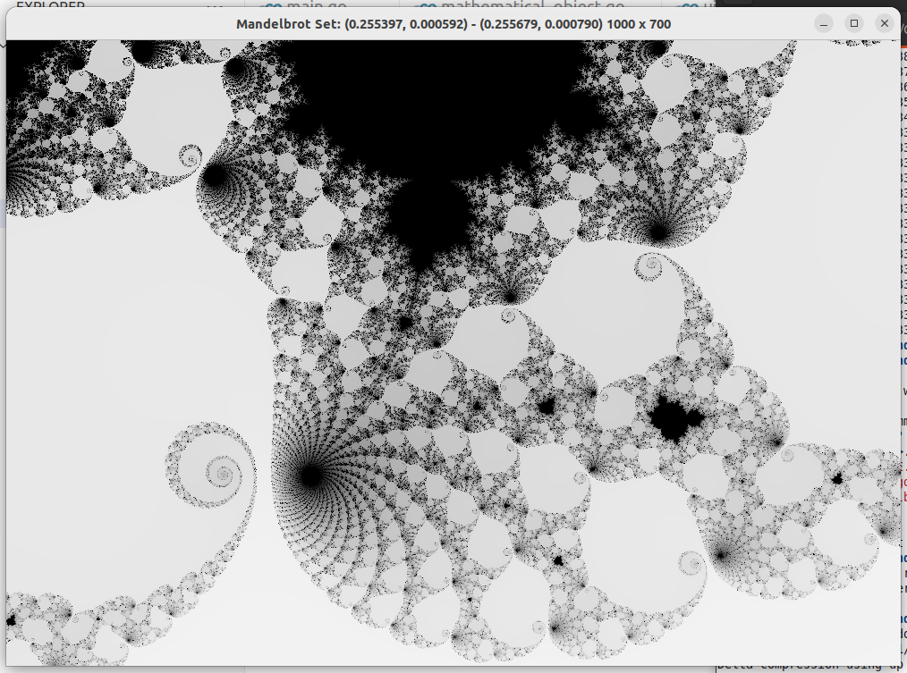

# Mandelbrot Set viewer in `golang`



`go run .`

I used this to learn `golang`

- [x] Methods
- [x] Interfaces
- [ ] Generics
- [ ] Profiling
- [ ] Parallelism
    - [ ] Stopping goroutines
    - [ ] Writing to a shared array
    - [ ] Data races
- [ ] Benchmarking

Because I got nerdsniped into visualizing mathematical objects

- [ ] Mandelbrot set
    - [ ] (Stretch) With parallelization, symmetry and boundary tracing
- [ ] [Ulam spiral](https://en.wikipedia.org/wiki/Ulam_spiral)

# Notes

## Interfaces and private methods

Allowing private method declarations on interfaces is a waste ...


## Generics, methods and type aliases

```
package main

import "fmt"

type A[T int | float64] struct {
	X0 T
}

func (a A[T]) Same(ref A[T]) bool {
	return a.X0 == ref.X0
}

type B = A[int]
type C A[int]

func main() {

	w, x := B{1}, B{2}
	y, z := C{1}, C{2}

	fmt.Println(w.Same(x))
	fmt.Println(y.Same(z))
}
```

`24:16: y.Same undefined (type C has no field or method Same)`

https://stackoverflow.com/a/61248625

C is a new type definition that inherits all the fields, but 
not the methods. Which is an interesting design decision.


## Privacy

I wanted the `drag_event` to be private in `ui` because there is no reason for
an end user to access it, but the internet consensus seemed to be "Don't
overthink it." with the best solution, if I really wanted to, being to put the
UI code in a separate package and use package level access control (Capitalized
variables/methods are public and lowercase ones are private). I decided to just
let it be.