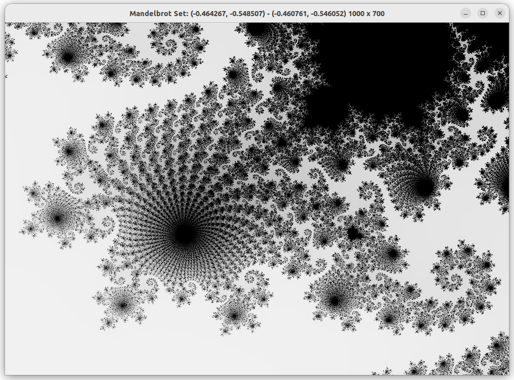

# Mandelbrot Set viewer in `golang`

[screencast](https://youtu.be/cFiIzbs1vqc)

`go run .`

I used this to learn `golang`. [My `golang` learning blog posts](https://kaushikghose.wordpress.com/tag/golang/)

- [x] Methods
- [x] Interfaces
- [x] Generics
- [x] Profiling
- [x] Parallelism
    - [ ] Stopping goroutines
    - [x] Writing to a shared array
    - [ ] Data races
- [x] Benchmarking

Because I got nerdsniped into visualizing mathematical objects

- [x] Mandelbrot set
    - [x] (Stretch) With parallelization, 
	- [ ] symmetry and boundary tracing
- [ ] [Ulam spiral](https://en.wikipedia.org/wiki/Ulam_spiral)
